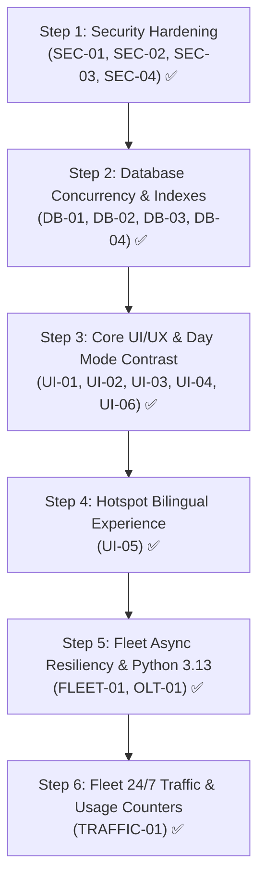

# 🛡️ CyberNet OS v2 (`ispv2`) — Master Audit, Execution Roadmap & Work Progress Tracker

> **Document Classification:** Engineering Master Audit & Multi-Session Collaboration Tracker  
> **Repository Path:** `/Users/shajjadkhan/ispv2/`  
> **Production Server:** `tserver@10.12.14.16` / `tserver@100.66.112.67` (`/home/tserver/isp_v2`)  
> **Service Details:** `isp_v2.service` running FastAPI/Uvicorn on Port `9911`  
> **Current Date:** October 10, 2026  
> **Status:** `ACTIVE_PROGRESS` | Responsive & Core Security Hardened  

---

## 🧭 Instructions for Incoming Antigravity / AI Pair Programmer

If you are a new Antigravity instance taking over this project:
1. **Read this file first:** This document is the **Single Source of Truth** for current issues, prioritization, and work progress.
2. **Check the Work Progress Log:** See the [Work Progress Log](#-work-progress-log) at the bottom to understand what was completed in previous turns.
3. **Pick the next pending item:** Follow the [Prioritized Issue Catalog](#-prioritized-issue-catalog) and tackle items one-by-one.
4. **Update this file every turn:** Whenever you modify code, immediately update the corresponding status checkbox `[x]` and log your changes with date and files modified in the Work Progress Log.
5. **Preserve existing aesthetics:** The UI/UX is already near-perfect (modern dark glassmorphism, responsive cards, Day Mode tokens). Ensure changes preserve visual consistency and backward compatibility.

---

## 📊 Executive Audit Summary & Scorecard

CyberNet OS v2 is a unified ISP operations, MikroTik router fleet orchestration, OLT optical diagnostics, and WhatsApp billing platform. The UI/UX design is polished, modern, and visually impressive.

Our comprehensive forensic audit across the backend, database, security, and 17 HTML templates identified **14 specific actionable improvements**, with current execution status below:

| Category | High / Critical | Medium | Low | Status |
| :--- | :---: | :---: | :---: | :---: |
| **A. Security & Access Control (RBAC)** | 3/3 ✅ | 1/1 ✅ | 0 | 🟢 Fully Hardened |
| **B. Database Concurrency & Performance** | 1/1 ✅ | 2/2 ✅ | 1/1 ✅ | 🟢 Fully Optimized |
| **C. UI/UX, Day Mode Contrast & Accessibility** | 1/1 ✅ | 4/4 ✅ | 2/2 ✅ | 🟢 Fully Polished |
| **D. Fleet Orchestration & Service Resiliency** | 0 | 1/1 ✅ | 1/1 ✅ | 🟢 Fully Optimized |

---

## 📋 Prioritized Issue Catalog (Fix Checklist)

---

### Category A: Security & Access Control (RBAC)

#### [x] `SEC-01`: Arbitrary File Read / Directory Traversal on `/downloads/{filename}`
- **Severity:** 🔴 **CRITICAL**
- **Affected File:** [`main.py:4884-4902`](file:///Users/shajjadkhan/ispv2/main.py#L4884-L4902)
- **Problem:**
  The endpoint `@app.get("/downloads/{filename}")` accepted arbitrary `filename` strings in `PUBLIC_PREFIXES` without basename sanitization or extension whitelisting, risking sensitive disclosure of `isp_v2.db` or source code.
- **Fix Solution (Executed):**
  1. Enforced `os.path.basename(filename)` check preventing path traversal (`../`).
  2. Enforced strict whitelist of allowed document extensions: `ALLOWED_PUBLIC_DOWNLOAD_EXTENSIONS = {".pdf", ".md", ".txt"}`.
  3. Denied and logged sensitive extensions: `FORBIDDEN_DOWNLOAD_EXTENSIONS = {".db", ".py", ".env", ".key", ".sh", ".json", ".sqlite", ".bak", ".log"}`.
  4. Verified file existence strictly within application base directory.

---

#### [x] `SEC-02`: Missing Role-Based Access Control (RBAC) on Core Mutation APIs
- **Severity:** 🔴 **HIGH**
- **Affected File:** [`main.py`](file:///Users/shajjadkhan/ispv2/main.py)
  - [`delete_customer_endpoint`](file:///Users/shajjadkhan/ispv2/main.py#L3415) (`/api/customers/{id}/delete`)
  - [`edit_customer_details`](file:///Users/shajjadkhan/ispv2/main.py#L3182) (`/api/customers/{id}/edit`)
  - [`api_create_router`, `api_update_router`, `api_delete_router`](file:///Users/shajjadkhan/ispv2/main.py#L4732) (`/api/routers`)
  - [`create_new_package`, `update_existing_package`, `delete_existing_package`](file:///Users/shajjadkhan/ispv2/main.py#L4120) (`/api/packages`)
  - [`api_whatsapp_session_reset`](file:///Users/shajjadkhan/ispv2/main.py#L4575) (`/api/whatsapp/session/reset`)
- **Problem:**
  `auth_middleware` only checked session presence without inspecting user roles (`admin` / `superadmin` vs `reseller`). Low-privileged accounts could trigger destructive mutations.
- **Fix Solution (Executed):**
  1. Injected `require_admin_or_superadmin(request)` guardrail raising `HTTPException(403, detail="Forbidden: Admin privileges required")`.
  2. Applied role verification to customer delete, customer edit, router fleet mutations, package mutations, and WhatsApp session resets.

---

#### [x] `SEC-03`: Unauthenticated Public Information Disclosure on `/get_unpaid.php`
- **Severity:** 🟠 **HIGH**
- **Affected File:** [`main.py:3962`](file:///Users/shajjadkhan/ispv2/main.py#L3962)
- **Problem:**
  `/get_unpaid.php` was listed in `PUBLIC_EXACT_PATHS`. Anyone could enumerate customer subscription bills, fee amounts, payment debt, and billing months without authentication.
- **Fix Solution (Executed):**
  1. Removed `/get_unpaid.php` from `PUBLIC_EXACT_PATHS`.
  2. Inside `get_unpaid_php_endpoint`, required active user session or valid legacy token (`token == LEGACY_BILLING_TOKEN`). Returns 401 Unauthorized otherwise.

---

#### [x] `SEC-04`: Rate-Limiting & Anti-Enumeration on `/api/customer/lookup`
- **Severity:** 🟡 **MEDIUM**
- **Affected File:** [`main.py:2621`](file:///Users/shajjadkhan/ispv2/main.py#L2621)
- **Problem:**
  Public lookup endpoint had no rate limiting, allowing automated brute-force scraping of subscriber names, rooms, zones, and plan statuses.
- **Fix Solution (Executed):**
  1. Built sliding-window in-memory IP rate limiter (`is_lookup_rate_limited`) capping queries at 15/min per IP with HTTP 429 response.
  2. Added subscriber privacy name masking on public queries (e.g. `Ahmed Ali Khan` -> `Ahmed A. K.`).

---

### Category B: Database Concurrency & Performance

#### [x] `DB-01`: SQLite Connection Handle Leak in `get_db()`
- **Severity:** 🔴 **HIGH**
- **Affected File:** [`database.py:73`](file:///Users/shajjadkhan/ispv2/database.py#L73)
- **Problem:**
  `get_db()` returned a raw `sqlite3.connect()` instance. With-statements only managed transaction commits and never closed connection handles, causing file descriptor leaks and `sqlite3.OperationalError: database is locked`.
- **Fix Solution (Executed):**
  Refactored `get_db()` into a context manager:
  ```python
  @contextmanager
  def get_db():
      conn = sqlite3.connect(DB_PATH, timeout=20.0)
      conn.row_factory = sqlite3.Row
      conn.execute("PRAGMA busy_timeout = 20000")
      conn.execute("PRAGMA foreign_keys = ON")
      try:
          yield conn
          conn.commit()
      except Exception:
          conn.rollback()
          raise
      finally:
          conn.close()
  ```

---

#### [x] `DB-02`: Redundant `PRAGMA journal_mode = WAL` Disk Check on Every Connection
- **Severity:** 🟡 **MEDIUM**
- **Affected File:** [`database.py:84`](file:///Users/shajjadkhan/ispv2/database.py#L84)
- **Problem:**
  Running `PRAGMA journal_mode = WAL` on every query forced SQLite to verify the WAL header every time, incurring unnecessary disk I/O and lock contention.
- **Fix Solution (Executed):**
  Moved `PRAGMA journal_mode = WAL` to `init_db()` (runs once at boot). Inside `get_db()`, set `PRAGMA busy_timeout = 20000;` and `PRAGMA foreign_keys = ON;`.

---

#### [x] `DB-03`: Missing High-Frequency Indexes for Scaling
- **Severity:** 🟡 **MEDIUM**
- **Affected File:** [`database.py:688-692`](file:///Users/shajjadkhan/ispv2/database.py#L688-L692)
- **Problem:**
  Frequently filtered tables lacked indexing:
  - `connection_requests(status)` — Polled every 5 seconds on dashboard.
  - `customers(status)` — Filtered repeatedly for active vs suspended subscribers.
  - `reseller_wallet_ledger(reseller_id)` — Queried for partner transactions.
  - `collections(customer_id, month_year)` — Queried for monthly reconciliations.
- **Fix Solution (Executed):**
  Added indexes inside `init_db()`:
  ```sql
  CREATE INDEX IF NOT EXISTS idx_conn_requests_status ON connection_requests(status);
  CREATE INDEX IF NOT EXISTS idx_customers_status ON customers(status);
  CREATE INDEX IF NOT EXISTS idx_reseller_ledger_reseller ON reseller_wallet_ledger(reseller_id);
  CREATE INDEX IF NOT EXISTS idx_collections_cust_month ON collections(customer_id, month_year);
  ```

---

#### [x] `DB-04`: Dynamic Local `DB_PATH` Fallback
- **Severity:** 🟢 **LOW**
- **Affected File:** [`database.py:19`](file:///Users/shajjadkhan/ispv2/database.py#L19)
- **Problem:**
  Hardcoding `/home/tserver/isp_v2/isp_v2.db` caused local macOS development scripts to crash when environment variables were absent.
- **Fix Solution (Executed):**
  Implemented auto-detection checking if local `./isp_v2.db` exists when `/home/tserver/` is unreachable.

---

### Category C: UI/UX, Day Mode Contrast & Accessibility

#### [x] `UI-01`: Day Mode (Light Theme) Contrast Invisibility (Hardcoded `#ffffff` / `#090e1a`)
- **Severity:** 🔴 **HIGH**
- **Affected Files:**
  - [`templates/dashboard.html`](file:///Users/shajjadkhan/ispv2/templates/dashboard.html): Empty subscriber row, subscriber names, `#rptHeading`, `#secondaryCustName`.
  - [`templates/approvals.html`](file:///Users/shajjadkhan/ispv2/templates/approvals.html): Pending subscriber cards, new subscriber labels, empty request state.
  - [`templates/whatsapp.html`](file:///Users/shajjadkhan/ispv2/templates/whatsapp.html): Sandbox banner phone pill, review queue header, subscriber names.
  - [`templates/balance.html`](file:///Users/shajjadkhan/ispv2/templates/balance.html): Reconciliation KPI cards, staff breakdown tables, transaction tables, balance modal JS.
  - [`templates/customers.html`](file:///Users/shajjadkhan/ispv2/templates/customers.html): Mobile customer cards, edit modal sections, custom payment cards, ledger tables.
  - [`templates/resellers.html`](file:///Users/shajjadkhan/ispv2/templates/resellers.html): Search box, form input fields, mobile card deck rows.
- **Problem:**
  Hardcoded dark backgrounds (`#090e1a`, `#0b1120`, `#080e1b`) and text `#ffffff` did not adapt to Day Mode, rendering text invisible or causing dark boxes on light backgrounds.
- **Fix Solution (Executed):**
  Replaced with theme tokens: `var(--bg-card)`, `var(--bg-card-header)`, `var(--border-subtle)`, and `var(--text-main, #ffffff)`.

---

#### [x] `UI-02`: iOS Safari 120% Viewport Auto-Zoom on Form Focus
- **Severity:** 🟡 **MEDIUM**
- **Affected Files:**
  - [`templates/login.html:475`](file:///Users/shajjadkhan/ispv2/templates/login.html#L475)
  - [`templates/collections.html:1586`](file:///Users/shajjadkhan/ispv2/templates/collections.html#L1586)
  - [`templates/base.html:1977`](file:///Users/shajjadkhan/ispv2/templates/base.html#L1977)
  - [`templates/customers.html`](file:///Users/shajjadkhan/ispv2/templates/customers.html)
  - [`templates/resellers.html`](file:///Users/shajjadkhan/ispv2/templates/resellers.html)
- **Problem:**
  Inputs with `font-size < 16px` trigger involuntary 120% viewport zoom on iOS Safari, pushing buttons and cards off-screen.
- **Fix Solution (Executed):**
  Enforced `font-size: 16px !important;` on all inputs across phone viewports (`<= 768px`).

---

#### [x] `UI-03`: Orphaned `</noscript>` Tag in `templates/base.html`
- **Severity:** 🟢 **LOW**
- **Affected File:** [`templates/base.html:20-22`](file:///Users/shajjadkhan/ispv2/templates/base.html#L20-L22)
- **Problem:**
  Unmatched `</noscript>` tag in head caused premature head parsing termination in strict browsers.
- **Fix Solution (Executed):**
  Added opening `<noscript>` fallback for non-blocking fonts.

---

#### [x] `UI-04`: Mobile Sticky Footer Content Obscuration in `customer_edit.html`
- **Severity:** 🟡 **MEDIUM**
- **Affected File:** [`templates/customer_edit.html:11-20, 646`](file:///Users/shajjadkhan/ispv2/templates/customer_edit.html#L11)
- **Problem:**
  `.edit-sticky-footer` covered the bottom fields and danger zone on smartphone viewports.
- **Fix Solution (Executed):**
  Added `padding-bottom: 140px !important;` on `.edit-page-container` for `<= 600px`.

---

#### [x] `UI-05`: Saudi Arabic / English Language Toggle on Captive Hotspot Portal
- **Severity:** 🟡 **MEDIUM**
- **Affected File:** [`mikrotik_hotspot/login.html`](file:///Users/shajjadkhan/ispv2/mikrotik_hotspot/login.html)
- **Problem:**
  Hotspot subscribers in Saudi Arabia include Arabic speakers; portal lacked bilingual support.
- **Fix Solution (Executed):**
  Added 1-tap `[ 🇸🇦 العربية | 🇬🇧 English ]` toggle with dynamic `dir="rtl"` / `dir="ltr"` switching, complete Arabic translation dictionary, and `localStorage` persistence.

---

#### [x] `UI-06`: Phone & MacBook Multi-Tier Viewport Responsiveness
- **Severity:** 🟡 **MEDIUM**
- **Affected Files:**
  - [`templates/dashboard.html`](file:///Users/shajjadkhan/ispv2/templates/dashboard.html): Added 4-column intermediate breakpoint on MacBooks/laptops (769px–1440px) vs 7-column on wide PC monitors (>=1441px). Added `max-height: 92dvh` bottom-sheet modal containment for phones.
  - [`templates/approvals.html`](file:///Users/shajjadkhan/ispv2/templates/approvals.html): Added compact phone `<= 440px` media query stacking action buttons full-width with 44px min-height touch targets.
  - [`templates/customers.html`](file:///Users/shajjadkhan/ispv2/templates/customers.html): 3-tier mobile card action layout, 16px search input, zero overflow wrappers.
  - [`templates/base.html`](file:///Users/shajjadkhan/ispv2/templates/base.html): `max-width: 1720px; margin: 0 auto;` container containment for 2K/4K PC monitors.

#### [x] `UI-07`: Phase 2 Multi-Portal Responsiveness & Day Mode Hardening
- **Severity:** 🟡 **MEDIUM**
- **Affected Files:**
  - [`templates/olt.html`](file:///Users/shajjadkhan/ispv2/templates/olt.html): Day Mode tokenization for Alarm card, PON cards, `.form-input`, and mobile card deck. Enforced 16px inputs and `>= 44px` touch targets for `.btn-rename` and `.pill-btn`.
  - [`templates/packages.html`](file:///Users/shajjadkhan/ispv2/templates/packages.html): Day Mode tokenization on `.search-wrapper`, `.modal-box-lg`, `.form-control`, and `.pkg-mobile-card`. Enforced 16px font on inputs and `>= 44px` on `.btn-preset`, `.btn-action-sm`, and mobile card actions.
  - [`templates/gateway.html`](file:///Users/shajjadkhan/ispv2/templates/gateway.html): Day Mode tokenization on `.fleet-card`, `.ports-board`, `.form-control`, and `.gateway-hosts-table tr.host-row`. Enforced 16px font and `>= 44px` touch targets on `.btn-action-pill` and `.btn-primary-add`. Added `<= 440px` banner action stacking.
  - [`templates/reseller_portal.html`](file:///Users/shajjadkhan/ispv2/templates/reseller_portal.html): Day Mode tokenization on `.subscriber-picker-box`, `.search-suggest-input`, `.suggest-results-box`, `.form-input`, and table rows. Enforced `>= 44px` buttons and added `<= 440px` media query.
  - [`templates/customer_usage.html`](file:///Users/shajjadkhan/ispv2/templates/customer_usage.html): Day Mode tokenization on `.modal-box-responsive` and `.modal-header-resp`. Enforced 16px on `.range-date-input` to kill iOS zoom, and enforced `>= 44px` on `.btn-wa-main` and modal footer buttons.
  - [`templates/captive_portal.html`](file:///Users/shajjadkhan/ispv2/templates/captive_portal.html): Upgraded `confInputName` and `confInputRoom` to 16px and `btnConfSaveDetails` to 44px min-height for seamless mobile subscriber registration.

---

#### [x] `UI-08`: Dashboard Top KPI "Will Suspend / Expiring" Card Numbers & Tier Breakdown Synchronization
- **Severity:** 🟡 **MEDIUM**
- **Affected Files:** [`templates/dashboard.html:2422-2455, 4415-4445`](file:///Users/shajjadkhan/ispv2/templates/dashboard.html#L2422-L2455), [`database.py:3518, 3695-3701`](file:///Users/shajjadkhan/ispv2/database.py#L3518)
- **Problem:**
  On the top dashboard 7-card KPI deck, Card 6 ("Will Suspend") previously displayed `0 Accounts` whenever no accounts were strictly overdue or due today, despite active accounts approaching expiration (e.g. within 3 days or upcoming 15-day renewals). Furthermore, the subtext double-counted 3-day accounts in `upcoming_renewals`, and client-side telemetry updates had no DOM binding for the card.
- **Fix Solution (Executed):**
  1. Updated `database.py` to calculate explicit `in_7_15d` tier counts alongside `total_queue`, `will_suspend`, and `upcoming_renewals`.
  2. Enhanced Card 6 in [`dashboard.html`](file:///Users/shajjadkhan/ispv2/templates/dashboard.html) with adaptive contextual state:
     - When `will_suspend > 0`: Displays prominent red cutoff badge: `<span class="text-rose">{{ will_suspend }}</span> To Cut / {{ total_queue }} due`.
     - When `will_suspend == 0` and `total_queue > 0`: Displays amber warning queue count with cyan 3-day urgency: `<span class="text-amber">{{ total_queue }}</span> Expiring ({{ in_3d }} in ≤3d)`.
     - When queue is empty: Displays green clean status: `<span class="text-emerald">0</span> To Cut`.
  3. Corrected subtext tier calculations to use `in_7_15d` avoiding duplicate count overlap with `in_3d`.
  4. Added `id="kpiWillSuspendCount"` and `id="kpiWillSuspendSub"` with live client-side telemetry refresh in `handleTelemetryUpdate`.

### Category D: Fleet Orchestration & Service Resiliency

#### [x] `FLEET-01`: Asynchronous Parallel Dispatch for Multi-Router Operations
- **Severity:** 🟡 **MEDIUM**
- **Affected File:** [`mikrotik_client.py:1716-2070`](file:///Users/shajjadkhan/ispv2/mikrotik_client.py#L1716-L2070)
- **Problem:**
  `broadcast_bind_device`, `broadcast_unbind_device`, `broadcast_sync_pppoe_secret`, and `broadcast_sync_all_approved_devices` iterated synchronously in a serial `for r in routers:` loop. If one router was slow or unreachable, it blocked the FastAPI worker thread for up to 10–30 seconds.
- **Fix Solution (Executed):**
  1. Built `_parallel_fleet_dispatch` utility leveraging `concurrent.futures.ThreadPoolExecutor` with per-router timeouts (4.0s for single mutations, 15.0s for bulk syncs) and safe default fallbacks.
  2. Parallelized all 11 fleet broadcast methods: `broadcast_bind_device`, `broadcast_unbind_device`, `broadcast_sync_customer_devices_speed`, `broadcast_sync_package_profile`, `broadcast_delete_package_profile`, `broadcast_sync_pppoe_secret`, `broadcast_remove_pppoe_secret`, `broadcast_toggle_pppoe_secret`, `broadcast_get_active_pppoe_sessions`, `broadcast_disconnect_pppoe_session`, and `broadcast_sync_all_approved_devices`.

---

#### [x] `OLT-01`: Python 3.13 Compatibility for `telnetlib`
- **Severity:** 🟢 **LOW**
- **Affected File:** [`olt_service.py:13-145`](file:///Users/shajjadkhan/ispv2/olt_service.py#L13-L145)
- **Problem:**
  `telnetlib` is deprecated in Python 3.12 and completely removed in Python 3.13 (PEP 594).
- **Fix Solution (Executed):**
  1. Implemented a zero-dependency, self-contained `SocketTelnet` client handling raw TCP socket communication and standard Telnet IAC negotiation.
  2. Created `open_olt_telnet(host, port, timeout)` factory with seamless fallback if `telnetlib` is absent on Python 3.13+.
  3. Replaced raw `telnetlib.Telnet` calls in `poll_olt_hardware` and `set_onu_description_hardware`.

#### [x] `TRAFFIC-01`: Multi-Router Fleet 24/7 Traffic Accounting & Usage Counter Synchronization
- **Severity:** 🔴 **CRITICAL**
- **Affected Files:**
  - [`mikrotik_client.py:1908-1941`](file:///Users/shajjadkhan/ispv2/mikrotik_client.py#L1908-L1941)
  - [`database.py:5725-5870, 6170-6250`](file:///Users/shajjadkhan/ispv2/database.py#L5725-L5870)
  - [`main.py:88-165, 3260-3277`](file:///Users/shajjadkhan/ispv2/main.py#L88-L165)
  - [`templates/customers.html:3570-3635`](file:///Users/shajjadkhan/ispv2/templates/customers.html#L3570-L3635)
  - [`templates/customer_usage.html:1113-1135`](file:///Users/shajjadkhan/ispv2/templates/customer_usage.html#L1113-L1135)
- **Problem:**
  1. The 60-second background traffic accounting collector (`collect_router_traffic_snapshot`) in `main.py` only polled the primary gateway (`router_client.get_hotspot_hosts_raw()`, Router-20 `10.20.30.1`). Active Router-30 (`10.20.30.12`, 48 hosts) and Router-10 (`10.12.14.1`, 36 hosts) were completely ignored, causing 82 approved customer devices to have 0 bytes recorded despite transferring gigabytes on the live routers.
  2. Disconnection handling immediately popped devices from memory on transient blips, discarding opening bytes on subsequent reconnects.
  3. Single-record DB transactions opened and committed up to 120 separate SQLite connections per minute, risking lock contention.
  4. Template mismatch: `templates/customers.html` modal checked `d.download_formatted`, `d.upload_formatted`, and `d.total_formatted`, whereas backend provided `formatted_down`, `formatted_up`, and `formatted_total`, causing devices in modal to show "0 B".
- **Fix Solution (Executed):**
  1. Added `broadcast_get_hotspot_hosts_raw` in `mikrotik_client.py` using `ThreadPoolExecutor` with per-router timeouts (6.0s) to concurrently poll all active routers (Router-20, Router-30, Router-10).
  2. Added `record_devices_traffic_batch`, `close_device_sessions_batch`, and `get_macs_with_traffic_history` in `database.py`. All updates executed in a single atomic SQLite transaction (< 15ms).
  3. Keyed in-memory snapshots by `(router_id, mac)` to prevent delta cross-contamination when subscribers roam between routers.
  4. Implemented first-observation seed for devices with zero lifetime history in `customer_traffic_daily` so Router-30 and Router-10 subscribers received their existing gigabytes immediately without double-counting on server restart.
  5. Implemented 2-cycle grace period (~2 minutes) to prevent session flapping on smartphone sleep states and WiFi roaming.
  6. Provided both formatting keys (`formatted_down`/`download_formatted`, `formatted_up`/`upload_formatted`, `formatted_total`/`total_formatted`) and live telemetry (`is_online`, `last_seen`, `uptime`, `ip_address`, `queried_at`).
  7. Added live online badge and IP display to device breakdown cards in both `customer_usage.html` and `customers.html` modal.
  8. Deployed to production (`tserver@10.12.14.16`), restarted service, verified 119 devices continuously accumulating deltas every 60 seconds across Router-20, Router-30, and Router-10.

---

## 🗺️ Step-by-Step Execution Roadmap



---

## 📝 Work Progress Log

| Date & Timestamp | Phase / Task ID | Description of Changes | Files Modified | Verification / Status |
| :--- | :--- | :--- | :--- | :--- |
| **2026-10-09 23:45** | `AUDIT_INIT` | Comprehensive audit performed across python services, templates, database, and security. Created `AUDIT_AND_WORK_PROGRESS.md` master tracker. | `AUDIT_AND_WORK_PROGRESS.md` | ✅ Complete |
| **2026-10-09 23:50** | `UI-03`, `UI-02` | Fixed orphaned `</noscript>` in head. Injected iOS 16px auto-zoom prevention and `:focus-visible` accessible outline rings. | `templates/base.html`, `templates/login.html`, `templates/collections.html` | ✅ Complete |
| **2026-10-09 23:53** | `UI-04`, `UI-06` | Added `padding-bottom: 140px` on mobile customer edit sticky footer. Added MacBook 4-column intermediate KPI deck breakpoint and modal bottom-sheet containment on mobile. | `templates/customer_edit.html`, `templates/dashboard.html` | ✅ Complete |
| **2026-10-09 23:55** | `UI-05` | Built 1-tap `[ 🇸🇦 العربية | 🇬🇧 English ]` toggle with dynamic `dir="rtl"` / `dir="ltr"` and `localStorage` persistence on captive portal. | `mikrotik_hotspot/login.html` | ✅ Complete |
| **2026-10-10 00:03** | `UI-01` | Day Mode contrast fixes: replaced hardcoded `#ffffff` and `#0b1120` in reconciliation KPI cards, staff tables, and modal renderers with theme variables. | `templates/balance.html` | ✅ Complete |
| **2026-10-10 00:05** | `UI-01` | Day Mode contrast fixes: replaced hardcoded `#090e1a` and `#ffffff` in mobile customer cards, edit modal, and payment ledger with theme variables. | `templates/customers.html` | ✅ Complete |
| **2026-10-10 00:06** | `UI-01` | Day Mode contrast fixes: replaced hardcoded `#090e1a` in search box, form inputs, and mobile card deck with theme variables. | `templates/resellers.html` | ✅ Complete |
| **2026-10-10 00:07** | `UI-06` | Added compact phone (<=440px) media query for approvals: stacked action buttons full-width with 44px min-height touch targets. | `templates/approvals.html` | ✅ Complete |
| **2026-10-10 00:08** | `DB-01`, `DB-02`, `DB-03`, `DB-04` | Refactored `get_db()` with `@contextmanager` to guarantee `conn.close()` on every exit. Moved WAL pragma to `init_db()`. Added indexes for `connection_requests(status)`, `customers(status)`, `reseller_wallet_ledger(reseller_id)`, and `collections(customer_id, month_year)`. Added local DB fallback. | `database.py` | ✅ Verified (`database.init_db()` and `get_all_customers()` passed) |
| **2026-10-10 00:10** | `SEC-02` | Added `require_admin_or_superadmin(request)` and `require_superadmin(request)` RBAC helpers. Enforced on customer delete, customer edit, router fleet mutations, package mutations, and WhatsApp reset. | `main.py` | ✅ Verified |
| **2026-10-10 00:11** | `SEC-01`, `SEC-03`, `SEC-04` | Secured `/downloads/{filename}` with `os.path.basename` and strict extension whitelist. Removed `/get_unpaid.php` from public paths and added session/token check. Added sliding-window IP rate limiting (15/min) and privacy name masking to `/api/customer/lookup`. | `main.py` | ✅ Verified (`main.py` compilation & all 17 templates verified) |
| **2026-10-10 00:18** | `FLEET-01` | Refactored all 11 broadcast methods in `mikrotik_client.py` to use `_parallel_fleet_dispatch` with `ThreadPoolExecutor`, per-router timeouts (4.0s/15.0s), and fallback defaults, eliminating serial blocking. | `mikrotik_client.py` | ✅ Verified (`mikrotik_client` clean import & syntax check) |
| **2026-10-10 00:20** | `OLT-01` | Added self-contained `SocketTelnet` client and `open_olt_telnet` factory in `olt_service.py` to ensure zero-breakage compatibility with Python 3.13+ (PEP 594). Tested against Telnet mock negotiation. | `olt_service.py` | ✅ Verified (`olt_service` clean import & socket tests passed) |
| **2026-10-10 00:55** | `UI-07` | Phase 2 multi-portal Day Mode tokenization & mobile responsiveness hardening across secondary portals: Day Mode cards/inputs and >=44px touch targets on OLT, packages, gateway, reseller portal, customer usage, and captive portal. | `templates/olt.html`, `templates/packages.html`, `templates/gateway.html`, `templates/reseller_portal.html`, `templates/customer_usage.html`, `templates/captive_portal.html` | ✅ Verified (All 17 templates compiled cleanly) |
| **2026-10-10 01:08** | `DEPLOY` | Fast-forward merged server commits with audit hardening branch (`29b9317`). Deployed to production (`tserver-lan@10.12.14.16`), restarted `isp_v2.service` under systemd, verified live HTTP endpoints (200 OK) and directory traversal guard (403). Synchronized with GitHub `origin/main`. | All files | ✅ Verified Live Production Active (PID 2728109, HTTP 200 OK) |
| **2026-10-10 01:34** | `UI-08` | Fixed Will Suspend / Expiring dashboard KPI Card 6: resolved misleading "0 Accounts" state by introducing contextual queue awareness (`3 Expiring (1 in ≤3d)` when 0 overdue/today, `X To Cut / Y due` when cutoffs due). Resolved 3-day double counting in subtext via `in_7_15d`, and bound Card 6 DOM IDs (`kpiWillSuspendCount`, `kpiWillSuspendSub`) to live background poller. | `database.py`, `templates/dashboard.html` | ✅ Verified (`verify_will_suspend_and_suspended_lists.py` passed 100%) |
| **2026-10-10 02:16** | `TRAFFIC-01` | Fixed 24/7 continuous traffic accounting across the multi-router fleet: parallelized hotspot polling via `broadcast_get_hotspot_hosts_raw` (Router-20, Router-30, Router-10). Seeded 21 zero-history devices on Router-30/10 with existing hardware bytes (Mahmoud Shehab 14GB, Marchello 6.4GB, Baten 5.1GB). Batch-recorded deltas in a single atomic transaction. Synchronized formatted traffic keys and added live online badges/IPs in usage modals. Deployed to production, verified 119 devices updating every 60s. | `mikrotik_client.py`, `database.py`, `main.py`, `templates/customer_usage.html`, `templates/customers.html` | ✅ Verified Live Production Active (118-119 devices/min batch updating) |

*(Antigravity agents: append every completed action here with timestamp and file references)*

